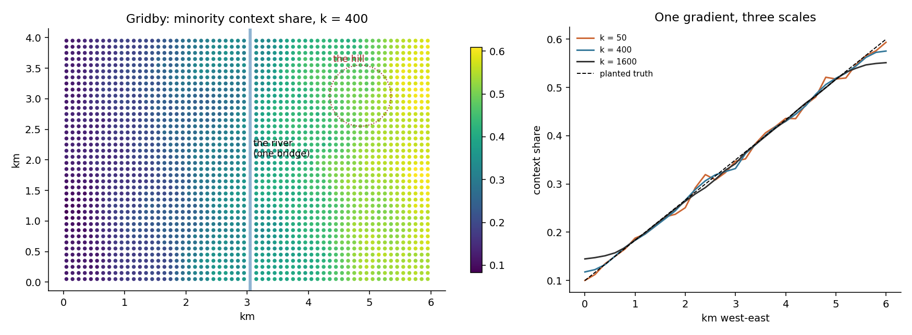

# 1. What EquiPop measures

## The idea

Ask a person in any town: "what is your neighbourhood?" Nobody
answers with the name of a statistical zone or a four-digit area
code. People experience the town from where they stand — the nearest
streets, the nearest shops, the nearest thousand people. EquiPop
takes that everyday experience seriously and turns it into a
measurement. For **every** person in the data (or, technically, for
every small square of the map that people live on), the software
looks outward from that person's own doorstep and collects their
**k nearest neighbours** — the closest 50, or 400, or 25,600 people,
where k is simply the number you asked for. It then describes that
personal collection: how many of them belong to some group you care
about, what the typical income among them is, how far away the last
of them lives.

Because the neighbourhood is built outward from each individual, it
is called an **egocentric** neighbourhood — "ego" being the person at
the centre. Every person gets their own, and no two are identical,
just as no two people share exactly the same view from their kitchen
window.

Why go to this trouble? Two reasons, and they are the reason this
software family exists at all. The first is that **the arbitrary map
disappears**. Administrative borders were drawn for taxation and
elections, not for describing social life, and two neighbours on
opposite sides of a district line are still neighbours. Egocentric
neighbourhoods do not know the border is there. The second reason is
that the neighbourhood gets a **size dial**. Is "my neighbourhood"
the fifty people nearest me, or the sixteen hundred? There is no
single right answer — so instead of choosing one, EquiPop lets you
compute them all. Any quantity you care about — a segregation index,
the share of highly educated people around each resident, an
accessibility score — stops being a single number frozen at one
administrative level and becomes a **profile across scales**: a curve
showing how the answer changes as the neighbourhood grows.

Very often, that curve is itself the finding. If a minority group is
strongly concentrated at the scale of fifty neighbours but the
concentration has faded by the scale of six thousand, the town sorts
people street by street rather than district by district — and that
is a different social story, with different policy implications,
than the reverse.



The figure introduces **Gridby**, the invented town used for the
examples throughout this book. Gridby was generated by a small
script (founded, in its fictional history, in 1848 — which is also
the random seed that makes it reproducible), and it was built with
*planted* properties that we know exactly: the minority share rises
smoothly from 10 % at the western edge to 60 % at the eastern edge,
a river with a single bridge runs down the middle, there is one
hill, and most jobs cluster west of the water. Real data shows
everything at once and therefore nothing clearly; Gridby lets every
figure in this book demonstrate exactly one phenomenon against a
truth we can check. In the left panel, each dot is a 100-metre
square coloured by the share of minority residents among the 400
people nearest to it. In the right panel, the same information is
averaged into a curve, once for each of three neighbourhood sizes.
Notice how the k = 50 curve is jumpy — small neighbourhoods are
noisy — while k = 1,600 is smooth, and all three follow the dashed
line, which is the gradient the town was actually built with. Same
town, same people, three magnifications of the same truth.

## Cook it

The example below is complete: you can paste it into any Python
window after chapter 2's installation and it will run. Reading it
line by line: the first three lines fetch the tools; `load("gridby")`
creates the teaching town; the `CellData(...)` call packs the town's
residents into the internal format the engines use (their
coordinates, how many people live in each square, and how many of
those belong to the group we labelled `g`); and the final line is
the actual analysis — one engine call, three neighbourhood sizes at
once.

```python
from equipop.datasets import load
from equipop.cells import CellData
from equipop.fastcounts import run_knn_counts

g = load("gridby")
p = g["people"]
cd = CellData(E=p.x.to_numpy(), N=p.y.to_numpy(),
              n=p.count_all.to_numpy(),
              binary_sums={"g": p.count_group.to_numpy()},
              value_arrays={}, unit_size=100.0)
out = run_knn_counts(cd, k_values=[50, 400, 1600])
print(out[["EastWest", "NorthSouth", "N_400", "R_g_400"]].head())
```

The result is a table with one row per inhabited square and a small
family of columns for every k you asked for. The naming is
systematic, so it is worth learning once. `N_400` is how many people
were actually counted when reaching for the 400 nearest — it can be
slightly more than 400, and the "Under the hood" section explains
why. `T_g_400` is how many of those belong to the group. `R_g_400`
is the share — T divided by N — which is the number most analyses
want. And `Dist_400` records how many metres outward the search had
to travel. Read `R_g_400` aloud as: "among the 400 people nearest to
this square, this is the fraction who belong to group g."

## The dials

`k_values` — as many scales as you like in one run; the engine is
built so that asking for five scales costs barely more than asking
for one. `unit_size` — the resolution of the underlying grid, in
metres (100 is the classic for register data). Everything else in
this book is, in a sense, more dials for this one idea.

## Under the hood

Three conventions do quiet work inside every result, and we state
them here once so later chapters can rely on them. First, k is
defined on **raw counts**, and whole squares enter the neighbourhood
at once: if the search has gathered 398 people and the next square
holds 5, all 5 come in, and `N_400` honestly reports 403 rather than
pretending to have stopped at exactly 400. Second, when several
squares lie at *exactly* the same distance, they enter together, as
one **atomic ring**. This makes results deterministic and symmetric
in every direction; a tiny tolerance (a millionth of a metre)
absorbs computer rounding noise, and a legacy mode can reproduce the
original 2000s software's one-square-at-a-time behaviour when
backward comparability demands it. Third, rows with missing
coordinates are dropped **with a printed count** — never silently —
and if the data runs out before k is reached, you receive partial
results with the honest numbers, never an empty cell.

## Pitfalls

The scale dial cuts both ways. Comparing the share at k = 400 in a
dense city with the share at k = 400 in the countryside compares
neighbourhoods of very different physical size — in the city those
400 people live within a few blocks, in the countryside they may be
spread over many kilometres. The population is held fixed; the
geography floats. That is a feature, and chapter 4 turns it into a
whole menu of choices — but only if you know it is happening.
