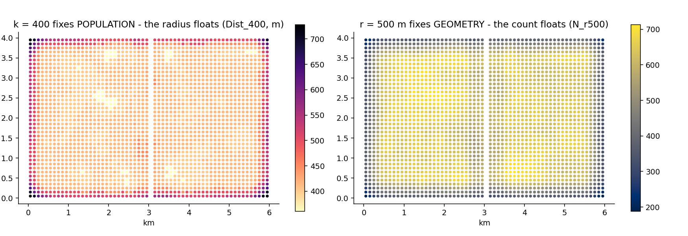

# 4. The neighbourhood definition menu

## The idea

"Neighbourhood" hides a decision: what do you hold FIXED? EquiPop
makes the decision explicit and offers the whole menu in one run:

- **k fixes POPULATION** — 400 people, wherever they live; the
  geography floats.
- **r fixes GEOMETRY** — everyone within 500 m, however many; the
  population floats.
- **tau fixes EFFORT** — everyone within 8 flat-equivalent rounds of
  walking, hills and rivers included (chapters 9–10).
- **the unbounded decayed sum fixes NOTHING** — everyone counts,
  discounted by distance (chapter 7).
- **area fixes ADMINISTRATION** — the municipality decides.



The figure is the whole argument. Left: with k = 400 fixed, the
*radius* becomes the variable — small in dense blocks, huge at the
town edge (`Dist_400`). Right: with r = 500 m fixed, the *count*
becomes the variable (`N_r500`). Neither is more correct; they answer
different questions, and comparing them is itself an analysis.

## Cook it

```python
out = run_knn_counts(cd, k_values=[400], r_values=[500])
# columns: N_400, R_g_400, Dist_400  AND  N_r500, R_g_r500

from equipop.area import area_stats
per_area = area_stats(df, area_col="Kommun",
                      binary_vars=["hi"], value_vars=["income"])
```

## The dials

Any mix of `k_values` and `r_values` in one call; `tau_values` on
the graph engines; `decay=` for the unbounded sum; `area_stats` for
the administrative family (weights supported for counts and shares).

## Under the hood

Columns exist only where they mean something: `Dist_` only for k
(for r, the distance IS r); `Rounds_` only on graph engines; area
mode has neither — areas do not expand, so nothing is measured, and
the columns are honestly absent rather than faked. A pleasing
simplification: the tie problem of chapter 1 **vanishes** for r and
tau, because every qualifying cell is included wholly by definition.

## Pitfalls

Radius users: `N_r500` varies enormously across space — that is the
point — so shares in sparse cells rest on few people. The `N_`/`Nv_`
columns always show the basis; report them.
