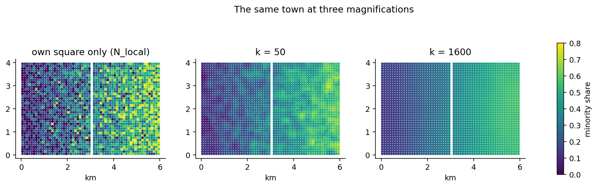

# 5. Counts and ratios: the fast engine

## The idea

This chapter belongs to the workhorse. Almost every analysis in the
book begins the same way: for every inhabited square, gather the k
nearest people and count who they are. The engine that does this is
called the *fast engine*, and its four output columns per scale —
`N`, `T`, `R` and `Dist` — are the vocabulary the rest of the book
speaks. It pays to sit with them for a moment longer than chapter 1
could afford.

`N_400` is the honest headcount: how many people were actually
gathered when reaching for 400. As chapter 1 explained, whole
squares enter at once, so the number can overshoot slightly — and
the engine reports the truth rather than trimming it, because every
share is only as honest as the count beneath it. `T_g_400` is how
many of those people carry the marker you asked about — the
letter T is for *treatment*, a habit from the software's research
history, and you can request several markers at once: highly
educated, foreign-born, under eighteen, each getting its own T and
R columns from a single run. `R_g_400` is the division of the two,
the *context share* — the single most used number in this family of
methods, readable aloud as "among this person's 400 nearest, the
share who are g". And `Dist_400` records the search radius in
metres, which is not a by-product but a finding in its own right:
it is the physical size of a 400-person world, small where the town
is dense and vast where it is not.

One more idea completes the picture: **pre-aggregated data**.
Register extracts often arrive with one row meaning "27 persons with
these properties in this square" rather than one row per person. The
cell format of chapter 2 is built for exactly this: the counts
simply *become* the cell masses, and every result behaves as if the
27 rows had been written out one by one. The example below shows the
direct route.



The figure shows why "which k?" deserves respect rather than habit.
All three panels colour the same quantity — the minority share —
for the same town. The left panel uses only each square's own
residents: it is truthful and almost unreadable, a static of tiny
denominators. The middle panel, k = 50, begins to show the planted
west-to-east gradient through heavy noise. The right panel,
k = 1,600, shows the gradient with complete serenity — and has, in
exchange, smoothed away every street-level detail. None of the
three is the correct picture. They are magnifications, and the
honest analysis reports the ones that matter for its question —
often several.

## Cook it

The call below computes two group markers at three scales in one
pass, on the Gridby data from chapter 1. Gridby's people table is
pre-aggregated — each row is a square carrying `count_all` persons —
so the counts go straight in as cell masses via `CellData`, with one
summed column per marker:

```python
from equipop.datasets import load
from equipop.cells import CellData
from equipop.fastcounts import run_knn_counts

g = load("gridby")
p = g["people"]
cd = CellData(E=p.x.to_numpy(), N=p.y.to_numpy(),
              n=p.count_all.to_numpy(),
              binary_sums={
                  "minority": p.count_group.to_numpy(),
                  "majority": (p.count_all - p.count_group).to_numpy()},
              value_arrays={}, unit_size=100.0)
out = run_knn_counts(cd, k_values=[50, 400, 1600])
```

(If your data is one row per person instead, `build_cells` from
chapter 2 does the aggregation for you — the two routes meet in the
same `CellData` and the engines cannot tell them apart.)

The result carries `R_minority_50` through `R_majority_1600` — six
share columns from one spatial search, because the engine finds
each square's neighbours once and counts all markers on the way.

## The dials

`k_values` and `r_values` (chapter 4) in any mix; `m_neighbors` and
`chunk`, two purely technical knobs that trade memory for speed and
that you will likely never touch; and `origins=`, which computes
results for a subset of squares while keeping the full population
as the searchable mass — the key that unlocks the very large runs
of chapter 17.

## Under the hood

The speed comes from a data structure called a KD-tree — think of
it as a pre-sorted index of the map that can answer "what is near
this point?" without checking every square. Using it, the original
research runs processed seventy-three thousand Stockholm squares in
under a minute, and chapter 17 stretches the same engine to
national scale. One guarantee is worth knowing because it protects
you silently: the engine first fetches a generous batch of
neighbours per square, and if any square's batch turns out too
small to reach its k (it happens at the edge of sparse regions),
that square is automatically re-queried against the whole dataset.
The result is always exact — the batching is a speed device, never
an approximation.

## Pitfalls

Two habits keep fast-engine results honest. First, never compare an
R at one k with an R at another as if they measured the same thing
— chapter 1's magnification lesson in reverse. Second, treat
`N_local` (the own-square headcount) with care in publications:
with register data, a map of squares containing one or two
identifiable people is a disclosure risk, which is one reason the
aggregation of chapter 2 exists at all. The egocentric shares are
naturally safer — they always average over k people — but the local
column deserves a privacy glance before it travels.
