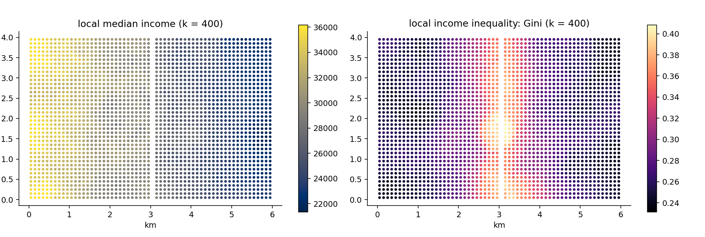

# 6. Value statistics: the neighbourhood as a distribution

## The idea

Shares answer "how many of my neighbours are X?" This chapter's
engine answers a richer question: "what are my neighbours *like*?"
Take income. Among each person's 400 nearest, one can compute the
average income, the median income (the middle person's — often more
telling than the average, because a single millionaire drags an
average but not a median), the standard deviation, and even a
**Gini coefficient** — the classic 0-to-1 measure of inequality,
where 0 means everyone earns the same and values towards 1 mean a
few earn nearly everything. Computing a Gini *per neighbourhood*
turns inequality itself into a local, mappable variable: not "is
this country unequal?" but "how unequal is the world each person
actually lives in?" — which can then sit on the right-hand side of
a regression like any other characteristic.

Real registers have holes: some people's income is missing, coded
away, or genuinely unknown. The engine's convention here deserves a
careful sentence, because it is easy to guess wrong. A person with
a missing income **still counts as a neighbour** — they live there,
so they belong to the k — but they contribute nothing to the income
statistics. And so every statistic travels with a companion column,
`Nv_` (for *N valid*), reporting how many of the k actually had a
usable value. A median of 400 neighbours resting on 396 valid
incomes is solid; the same median resting on 31 is a rumour, and
the `Nv_` column is how you tell the difference at a glance.



For this figure, Gridby's residents were given invented incomes —
the town has no economy of its own, so the script draws lognormal
incomes, somewhat higher in the west and deliberately more unequal
near the river, purely to have something worth mapping. The left
panel shows the local median at k = 400: the built-in west-east
tilt appears exactly as planted. The right panel maps the local
Gini — and this is the picture worth pausing on, because it is a
map most statistics never produce: *inequality as experienced*,
square by square, highest in the band along the river where the
script mixed rich and poor most thoroughly. Two neighbourhoods can
share the same median and live in utterly different worlds; the
pair of maps together says so.

## Cook it

```python
from equipop.cells import build_cells
from equipop.analysis import run_knn_stats

cd = build_cells(df, "x", "y", unit_size=100,
                 binary_vars=["HighEdu"],
                 value_vars=["income"])
out = run_knn_stats(cd, k_values=[400, 1600],
                    stats={"income": ["mean", "median", "gini"],
                           "HighEdu": ["ratio"]})
```

Reading the call: `value_vars` declares which columns hold
continuous values (their actual numbers are kept, square by square,
for exact statistics — see below); the `stats` dictionary then says
which statistics each variable should receive. The output follows
the naming system: `Mean_income_400`, `Med_income_400`,
`Gini_income_400`, their basis `Nv_income_400` — and, because the
engine also handles group markers, `R_HighEdu_400` arrives from the
same run.

## The dials

The statistics registry currently offers `mean`, `sd`, `se`,
`median`, `gini` for values and `ratio` for group markers — and
"registry" is meant literally: adding a new statistic to the
software is one dictionary entry, not new machinery, so the list
grows on request. `k_values` and `r_values` combine as always
(chapter 4): the median income within 500 metres is one option
away.

## Under the hood

A median cannot be computed from summaries: you need the actual
values, sorted. The engine therefore keeps, for every square, the
stored list of its residents' values, and when a neighbourhood is
assembled, the statistics are computed on the genuinely pooled
numbers — the median is the *exact* median of those k people, the
Gini the exact Gini, not an approximation stitched from per-square
averages. This costs memory, which is why continuous variables must
be declared in `value_vars` rather than being carried by default,
and it is the honest price of statistics one can cite without
footnotes.

## Pitfalls

Two, both about small print. A Gini computed on very few valid
values is unstable — with `Nv` below a few dozen, treat the number
as weather, not climate, and consider filtering such squares from
maps. And register incomes are often *top-coded* (capped at some
ceiling for confidentiality): means and Ginis feel the cap, medians
usually do not — one more reason the median is the workhorse of
neighbourhood income analysis.
