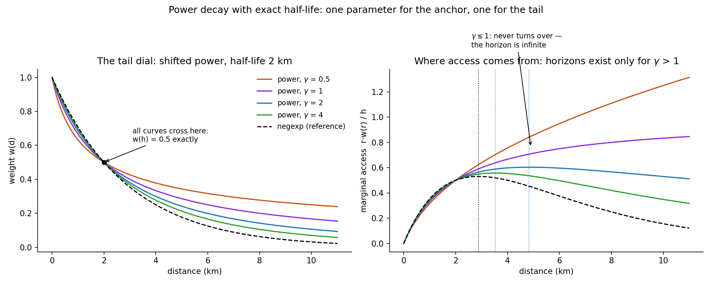

# 7. Distance decay: nearer matters more

## The idea

Everything so far has treated the k-th neighbour exactly like the
first: inside the neighbourhood, everyone counts as one. That is a
clean convention, but it quietly contradicts everyday experience —
the family next door plainly matters more to your daily life than a
household four kilometres away who happens to be your 1,599th
nearest. **Distance decay** repairs this by giving every neighbour
a weight that starts at 1 on your own doorstep and fades with
distance, so that counts and shares become *weighted* counts and
shares in which nearby people carry more.

The question is how fast the fading should happen, and EquiPop's
answer is a dial with a physical meaning: the **half-life**. You
state one number — the distance at which a neighbour should count
half as much as someone at your door — and the software computes
the technical curve parameters for you. "Half-life 2 kilometres" is
a statement a reader can picture; the equivalent raw coefficient
(a beta of −0.00034662) is not, and that is the whole reason the
dial exists.

Around that single dial, the software offers a *family of curve
shapes*, because a century of research has found that different
phenomena fade differently: commuting tolerates distance
differently than shopping, and migration differently again. Five
shapes are built in — the gently fading exponential (`negexp`, the
default and the workhorse), a bell-like curve that stays flat
nearby then drops (`expnormal`), two intermediate shapes, and the
**power** family, whose personality deserves its own paragraph. A
power curve drops steeply at first and then almost refuses to die:
even far away, it keeps a little weight. Since version 1.4 the
power curve takes a second dial, gamma, that controls the
*thickness of that far tail* independently of the half-life —
small gamma for "distance never quite kills relevance", large
gamma for "beyond the half-life, interest collapses".



The figure earns a slow look. In the left panel, four power curves
with different gammas all pass through exactly the same point — a
weight of one half at the two-kilometre half-life — because the
half-life is the anchor, while gamma fans the tails apart; the
dashed line is the familiar exponential for comparison. The right
panel asks a subtler question: if opportunities are spread evenly
across the map, *from what distance does most of your access
actually arrive?* Nearby rings are small (little area, few
opportunities); distant rings are large but heavily faded; in
between lies a sweet spot — the **opportunity horizon**, marked by
the dotted verticals, a concept chapter 12 builds into a full
analysis. And notice the two curves that never turn downward:
for gamma of one or below, the tail is so thick that access keeps
arriving from ever farther away — mathematically, the horizon is
infinite. The software tells you so, out loud, rather than
printing a misleading number.

## Cook it

Decay attaches to an analysis as one object. The example computes
ordinary and decayed results side by side, which is the recommended
habit — the comparison is free and often the finding:

```python
from equipop.decay import Decay
from equipop import run_knn

dec = Decay(model="negexp", half_life_m=2000)
out = run_knn(cells, k_values=[400], unit_size=100, decay=dec)
# plain columns:   N_400,  T_400,  R_400
# decayed columns: ND_400, TD_400, RD_400
```

Two conventions keep the columns interpretable. The neighbourhood
itself is still defined by the *raw* count — your 400 nearest are
your 400 nearest regardless of weighting — and the decayed columns
are then recorded for that same set of people, which guarantees a
decayed count can never exceed its raw twin. And for the boundary-
free variant from chapter 4's menu — every person in the data,
decay-weighted, no k at all — the fast engine accepts the same
object directly:

```python
out = run_knn_counts(cd, decay=Decay(model="power",
                                     half_life_m=2000, gamma=1))
# adds ND_inf, TD_g_inf, RD_g_inf  ("inf" for unbounded)
```

## The dials

`model` (the five shapes), `half_life_m` (the dial with a meaning),
`gamma` (the power family's tail thickness), and `beta` for experts
who want to set the raw coefficient directly. The older power form
without gamma remains available so that results from earlier
versions reproduce exactly.

## Under the hood

The unbounded sums cannot literally visit every square in a
country, so the engine computes, per curve, the distance at which
the weight falls below a millionth, and stops there — printing that
truncation radius so the choice is on the record. For the curious:
the "exact half-life for any gamma" trick works by shifting the
power curve's starting point, which is also why the legacy power
form (which shifted by a fixed one metre) had an oddly heavy tail —
a story told in full in the design-decision register of Appendix B.

## Pitfalls

The half-life is a *modelling choice*, and the most common mistake
is treating it as a fact. Where possible, estimate it — observed
commuting flows, when available, let the data choose its own
half-life (a planned feature waits exactly for such a file) — and
where not, report results at two or three half-lives so the reader
sees what depends on the dial. And never compare decayed numbers
across different curve shapes as if the shapes were
interchangeable: at the same half-life, a power curve and an
exponential agree at exactly one distance and disagree everywhere
else — that is, after all, the entire point of having a family.
