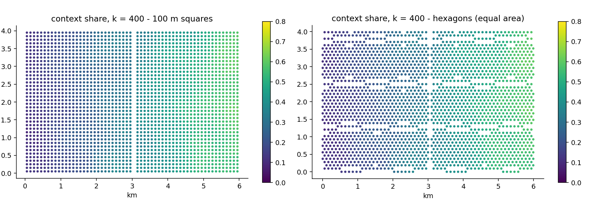

# 8. Hexagons: changing the tiles under the town

## The idea

Every result so far has stood on a grid of squares, and a fair
reader should ask: how much of what I see is the town, and how much
is the squares? The question has a formal name — the **Modifiable
Areal Unit Problem**, MAUP to its friends — and it is one of
geography's oldest embarrassments: draw the collection units
differently and many statistics change, sometimes a little,
sometimes alarmingly. Electoral gerrymandering is the famous
weaponised case; innocent grid choices are its accidental cousin.

Squares have two quirks worth knowing. A square has two kinds of
neighbour — four that share an edge, at distance one, and four that
touch only at a corner, at distance one-and-a-half in walking terms
but often treated the same — which injects a faint diagonal flavour
into anything built on adjacency. And a square grid has two
privileged directions, which a strongly gridded street plan can
resonate with. The classic alternative is the **hexagon**: six
neighbours, all sharing a proper edge, all at exactly the same
centre-to-centre distance, no corner-only contacts, no privileged
axis. Beehives and board-game designers converged on it for the
same reason.

EquiPop's position is not that hexagons are better — it is that the
choice of tiles should be a **testable dial**, not an unexamined
habit. Swapping the tessellation is one function call; everything
downstream (every engine, every statistic, every chapter of this
book) runs unchanged on either; and re-running an analysis on both
is a do-it-yourself MAUP experiment that turns an old embarrassment
into a robustness check for your particular result.



The figure runs the chapter 1 analysis twice on Gridby — identical
people, identical k = 400, only the tiles changed (the hexagons are
sized to match the squares' area, so the comparison is fair). The
two maps are, to the eye, the same map; the share ranges agree to
the second decimal (0.08–0.61 on squares, 0.09–0.61 on hexagons).
That resemblance is not an accident of Gridby — it is the
egocentric method doing its job. Because neighbourhoods are built
from *people counted outward*, not from the tiles themselves, the
tiles only decide how finely the population is pinned down before
the counting starts. In the original research validation, a
POI-density analysis of Malta that wobbled noticeably under
square-grid changes became stable once the egocentric machinery
ran on top — the method absorbs most of what MAUP throws at it,
and this chapter is how you verify that claim on your own data
rather than taking it on faith.

## Cook it

```python
from equipop.hex import build_hex_cells
from equipop.fastcounts import run_knn_counts

hx = build_hex_cells(rows, "x", "y", binary_vars=["g"],
                     hex_size=107)     # width across flats, metres
out_h = run_knn_counts(hx, k_values=[400])
```

`build_hex_cells` is the hexagonal twin of chapter 2's
`build_cells`: same inputs, same declarations, and it returns the
same internal format — which is precisely why nothing downstream
needs to know the tiles changed. One sizing note: to compare
fairly against 100-metre squares, choose the hexagon width so the
*areas* match; 107 metres across the flats gives a hexagon of
almost exactly one hectare, the same ground as a 100-metre square.

## The dials

`hex_size` — the width across the flats, the hexagonal analogue of
`unit_size`. That is the whole list; the point of the design is
that there is nothing else to learn.

## Under the hood

Hexagons cannot be indexed by rounding coordinates the way squares
can; the builder uses the standard axial-coordinate mathematics
from computational geometry (snap to a skewed lattice, then a
small correction called cube-rounding picks the truly nearest
hexagon centre). The result is exact nearest-hexagon assignment,
and the printed output includes the same movement report as the
square snapper, so convention mismatches stay visible here too.

## Pitfalls

Two honest limits. First, comparability: a result at k = 400 on
squares and one on hexagons are comparable; a *radius* result needs
the equal-area sizing above, or you are comparing differently
grained pinning of the population. Second, the current boundary of
the software: the terrain machinery of the next two chapters —
rivers, hills, travel effort — presently runs on the square grid
only; its hexagonal counterpart (six equal neighbours make for
elegant effort models) is designed and on the roadmap, and this
book will gain the sentence announcing it when it lands. Until
then: tessellation experiments for counting and statistics,
squares for terrain.
