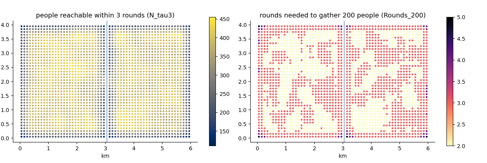

# 9. Friction: when straight lines lie

## The idea

Every distance so far has been drawn with a ruler — the straight
line from square to square. Towns are not rulers. A river without
a bridge makes two squares 200 metres apart effectively distant; a
railway yard, a motorway cutting, a fenced industrial estate do the
same. This chapter introduces the machinery that lets the map push
back: **friction**.

The mental model is walking. Imagine standing on your square and
spreading outward one step — one square — at a time; call each
sweep of steps a **round**. On an open plain, three rounds reach
everything within three squares, a tidy diamond. Now declare some
squares *costly*: entering a river square costs not one round but
seven (one for the step, six for the friction you assigned it).
The spreading walk now flows around the river, squeezes across the
bridge, and the shape of "what I can reach in three rounds" stops
being a diamond and starts being the truth. The software computes
this spreading exactly — the algorithm underneath is the classic
shortest-path method of computer science (Dijkstra's, for the
curious), run from every inhabited square.

Friction changes the *questions* you can ask, and two new column
families appear to answer them. `Rounds_200` answers "how much
walking effort until I have gathered my 200 nearest people?" — the
effort twin of `Dist_200`, and the two disagreeing is exactly
where the ruler was lying. And `tau` — chapter 4's third menu
item — turns the question around: `N_tau3` counts the people
reachable within an effort budget of three rounds, the honest
version of "who lives within fifteen minutes of me".



The figure lets Gridby's planted river (friction 6, one bridge)
speak. In the left panel, the colour is `N_tau3` — how many people
each square can reach in three rounds. Away from the water the
values follow simple density; along the river a dark seam appears
on both banks: for those squares, half the world sits behind a
six-round wall, and only the bridge's neighbourhood escapes the
shadow. In the right panel the same story is told in the other
currency — `Rounds_200`, the effort to gather 200 people — and the
seam brightens instead of darkens: river-hugging squares need more
rounds for the same crowd. Same wall, two shadows. In chapter 11
this seam reappeared, uninvited, as the edge of the LISA clusters
— planted geography echoing through every layer of analysis, which
is precisely what Gridby is for.

## Cook it

Friction arrives as a small table of costly squares — coordinates
plus a friction value — and everything else is one call:

```python
from equipop.datasets import load
from equipop.friction import run_knn_friction

g = load("gridby")
res = run_knn_friction(g["people"], k_values=[200],
                       fr=g["friction"], unit_size=100,
                       tau_values=[3])
# columns: N_200, Rounds_200, T_/R_ as usual, and N_tau3, R_tau3
```

The friction table's convention deserves one careful sentence:
squares *not listed* in the table cost the default, and the
default is zero extra — so the natural way to use the file is as a
**list of barriers**, naming only the rivers, the cuttings, the
fences. (If you prefer the opposite — listing the *passable*
squares in a world of walls — set `default_friction` high and list
the roads; the machinery is indifferent.)

## The dials

`fr` (the friction table) and `default_friction`; and since
version 1.15 the table need not be typed at all —
`features_to_friction` rasterizes your river and railway *line or
polygon features* onto the grid, with overlapping features stacking
their costs additively (a river and a railway in one square cost
both); `k_values` and
`tau_values` from the shared menu; and `origins=`, which computes
results for a subset of squares against the full population — the
same key that chapter 17 uses at national scale, available here
because effort computations are the expensive ones.

## Under the hood

Costs attach to the square being *entered* — friction is a
property of the destination step, added on arrival — and diagonal
steps count one-and-a-half, so that effort approximates true
walking distance rather than chessboard distance. The `Rounds`
reported are *flat-equivalent*: a value of 5 means "as much effort
as five open squares", whatever mixture of walking and wall-
climbing produced it, which keeps the number comparable across a
map. The engine was validated the way this book prefers: on real
Stockholm water barriers, where the correlation between beeline
and effort results decays with distance from the water in exactly
the pattern theory predicts. And a promise for the next chapter:
the machinery here treats all costly squares alike, whichever
direction you cross them — hills, where *direction matters*, get
their own chapter and their own mathematics, built on this same
spreading walk.

## Pitfalls

Friction values are model choices wearing numeric clothes. "The
river costs six" is a statement about how much that river deters,
not a measurement — so, as with half-lives in chapter 7, report
sensitivity (does the seam survive at friction three? at ten?)
rather than false precision. And keep the two uses of the table
conceptually separate: a *barrier* (high friction, rarely crossed)
and a *slowdown* (mild friction, routinely crossed) are different
claims about the world; a value of 2 says people cross constantly
at modest cost, a value of 50 says essentially never — make the
number say what you mean.
