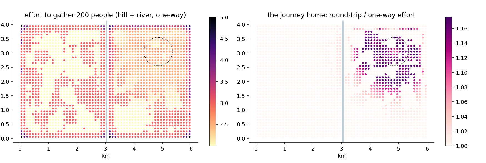

# 10. Slopes and the journey home

## The idea

Chapter 9's friction treats every barrier the same in both
directions: a river costs six to cross, eastbound or westbound. But
one kind of terrain refuses that symmetry. Walking *up* a hill and
walking *down* it are famously different experiences, and any
machinery that prices them equally has quietly flattened the world.
This chapter makes effort **directional**.

The ingredient is an elevation model — a height for every square of
the map, from a national terrain file or, as here, from Gridby's
planted hill. From heights come **slopes**: for every step between
neighbouring squares, the software knows the rise (or fall) over
the run. Each step's cost is then the ordinary one round *multiplied
by a slope penalty*, and the penalty curve is a chooseable model.
The default is the venerable **Tobler hiking function**, distilled
from real walking data a half-century ago, and it encodes two
truths worth saying in words: climbing is punished increasingly
steeply, and — the subtle one — the cheapest step is not the flat
one but a *very gentle descent*, exactly as every hiker knows in
their knees. A simpler linear model is available when you would
rather state your own price per percent of climb, separately for up
and for down.

Directionality unlocks a question that symmetric friction cannot
even ask: **what about the journey home?** Every trip out of a
valley is a climb back; every errand from a hilltop is a climb at
the end. With `roundtrip=True`, the software computes the outbound
and the homebound effort along their own best paths and reports
their average — so the numbers stay comparable with one-way runs
(on flat ground the two are identical, and the software's tests
hold it to that), while genuinely hilly ground reveals its
asymmetries. In the original Malta validation this produced the
memorable "valley tax": residents of the lowest-lying quarter of
the island carried a measurably heavier round-trip stretch than
hillside dwellers, a pattern invisible to every symmetric method.



On Gridby, the left panel shows one-way effort to gather 200
people, with both terrain features at work: the river's seam from
chapter 9, and now a warm halo on the north-eastern hill (the
dotted circle) where every direction out means climbing. The right
panel asks the round-trip question — homebound effort divided by
outbound — and the hill lights up alone: for its residents, the
full cost of daily life runs up to 18 % above what a one-way
analysis would report. The river, note, stays dark in this panel:
a river punishes both directions alike, so the round trip forgives
it nothing and adds nothing. The two panels together are the
chapter's argument: *symmetric* obstacles shape the left map,
*asymmetric* ones the right.

## Cook it

```python
from equipop.datasets import load
from equipop.slope import run_knn_slope

g = load("gridby")
res = run_knn_slope(g["people"], k_values=[200],
                    altitude="dem.tif",     # or a DataFrame(x, y, alt)
                    fr=g["friction"],       # rivers still apply
                    roundtrip=True, unit_size=100)
# columns as chapter 9, with Rounds_200 now terrain-aware
```

The altitude can arrive three ways: a path to a terrain raster
(GeoTIFF), which the software averages into square heights for you,
sea-noise clipped and reported; a plain table of `x, y, alt`; or a
raw array. Friction and slopes combine naturally — the river costs
its six *and* the approach to it may climb — because barriers and
terrain are different facts about the same walk.

## The dials

`model` ("tobler" or "linear"), the linear model's `lambda_up` and
`lambda_down` (your price per unit of climb and of descent),
`roundtrip`, `tau_values` for effort budgets, and `origins=` for
subset runs at scale. A flat elevation model reproduces chapter 9
*exactly* — regression-tested — so slopes are strictly an
extension, never a reinterpretation.

## Under the hood

The slope of a step is computed over the true centre-to-centre
distance — a diagonal step is longer, so the same rise is a gentler
grade — and the penalty multiplies the *movement* cost while
friction adds to the *destination*, a division of labour that keeps
the two ideas composable. Round trips are computed by running the
spreading walk twice, once outward and once with every step's
direction reversed, then averaging per leg. And all reported
`Rounds` remain *flat-equivalent* (chapter 9's currency): a 5 means
"as much effort as five open, level squares", whatever mixture of
climbing produced it.

## Pitfalls

Terrain data has resolution, and slopes are its derivative — the
noisiest thing you can compute from it. A 90-metre elevation model
averaged into 100-metre squares gives honest neighbourhood-scale
grades; expecting it to know about a staircase is asking the data
for fiction. And the hiking-function warning mirrors chapter 9's:
Tobler describes walking. For cycling, driving, or wheelchair
accessibility the penalty curve is a different research statement —
the linear model with your own lambdas is the honest tool there,
reported with the same sensitivity habit as every other dial in
this book.
