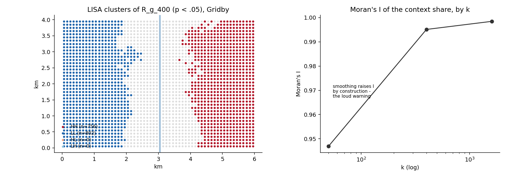

# 11. Spatial autocorrelation: clusters, hot spots, and one loud warning

## The idea

Segregation profiles (chapter 12 in the numbering to come) ask *how
unevenly* a group is distributed. Spatial autocorrelation asks a
different question: *does the map cluster?* Do high-value cells sit
next to high-value cells (positive autocorrelation), do they
alternate like a checkerboard (negative), or is the pattern
indistinguishable from shuffled tiles? **Moran's I** answers globally
with one number between roughly −1 and +1; its local decomposition
(**LISA**) answers per cell, labelling each as part of a High-High
cluster, a Low-Low cluster, or a lonely outlier (High-Low, Low-High);
**Getis-Ord Gi\*** ranks hot and cold spots on a z-scale.

EquiPop's contribution is that the **weights matrix** — the formal
answer to "who counts as whose neighbour" — comes from the same menu
as everything else: the k nearest cells (with the atomic tie ring of
chapter 1), a distance band, or decay weights from any of the five
half-life families. And, in the family style, every statistic can be
run as a **profile across scales**.



On Gridby, LISA finds exactly what was planted: a High-High cluster
filling the east, Low-Low filling the west, the boundary riding the
gradient with the river visible in its edge. The right panel shows
the profile — and motivates this chapter's warning.

## Cook it

```python
from equipop.autocorr import (build_weights, morans_i,
                              local_morans, local_g)

W = build_weights(out.EastWest, out.NorthSouth, mode="knn", k=8)
glob = morans_i(out.R_g_400, W, permutations=999, name="R_g_400")
lisa = local_morans(out.R_g_400, W, permutations=999)
gi   = local_g(out.R_g_400, W, star=True)
```

`lisa` returns one row per cell: the local statistic `Ii`, the
quadrant label, and a conditional-permutation pseudo p-value. Join it
back to your table and map the significant quadrants — the classic
LISA cluster map.

## The dials

`mode` (knn / r / decay) and its size parameter; `row_standardize`
(on by default; switch off for G statistics, which want binary
weights); `permutations` and `seed` (inference is permutation-based
and reproducible); `autocorr_profile(df, cols)` for one I per scale.

## Under the hood

The local Moran moment uses the **(n−1)** denominator to match
PySAL's `esda` exactly — the module is cross-validated against esda
to 1e-9 (LISA) and 1e-8 (Gi*), with the one documented difference
that our k-NN weights include equidistant ties as a whole ring.
Missing values are mean-imputed for the global statistic *with a loud
count*; cells without neighbours get NaN locals, never silent zeros.

## Pitfalls

**The loud warning, in full.** If you autocorrelate an EquiPop
context column — any `R_*_k` — the module prints a caution, because
overlapping egocentric neighbourhoods correlate **by construction**:
two people 100 m apart at k = 1,600 share almost all of their
neighbours, so the smoothed surface is autocorrelated even if the
underlying process is pure noise. On Gridby, I rises from 0.947 to
0.998 as k grows — that is the smoothing, not the town. Measuring it
is legitimate (it answers "how far does the smoothed structure
reach?"), but it is not the autocorrelation of the raw residential
process. Test raw local shares, or model the induced correlation,
when the raw process is the question. Knowing which question you are
asking is the entire pitfall.
