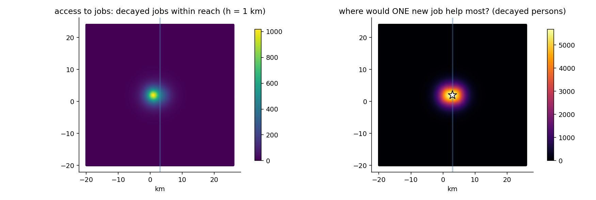

# 12. Access potential: what can be reached, and from where it comes

## The idea

The neighbourhood chapters ask who is *around* each person. This
chapter turns the question outward: what can each place *reach*?
The measure is nearly a century old and admirably simple — sum up
everything of interest (jobs, shops, clinics), letting each item
count less the farther away it is, using exactly chapter 7's decay
weights. The result is called an **access potential** (after Hansen,
who proposed it for jobs in 1959): a single number per location,
"the decayed mass of opportunity within reach". High where
opportunity is close and plentiful, fading with distance from it.

Two properties make the EquiPop version worth a chapter rather
than a footnote. The first is speed with exactness: computing the
potential at *every* square of a map sounds like a million-by-
million sum, but a classical piece of mathematics (the Fast Fourier
Transform — the same trick inside every audio equalizer) computes
all of it at once, exactly, in about a second for a whole country
of grid squares. No sampling, no approximation, no iterations.

The second property is a happy double meaning. Feed the machine
*opportunities* (jobs) and each square's value reads "how much can
a resident here reach" — the access map. Feed it *people* instead,
and each square's value reads "how many decay-weighted residents
could reach something placed *here*" — which is precisely the
question a planner asks before opening a clinic, a supermarket, or
a bus stop. The same computation, pointed the other way, becomes a
**site-search surplus map**, and its brightest square is the best
location for the next facility.



On Gridby the two readings share a figure. The left panel is
access to jobs at a one-kilometre half-life: bright around the
planted western jobs cluster, dimming eastward, with the river's
faint shadow (access here is straight-line; chapter 10's effort
version returns below). The right panel is the reversed question —
where would a single new job reach the most decay-weighted people?
— and the white star marks the answer, which turns out to be a
small delight: the best square sits **one cell west of the bridge,
at exactly the bridge's height**. Nobody told the mathematics about
the bridge; it found the town's pinch-point on its own, because
that is where the two banks' populations come closest to being one
market. Planted geography, discovered independently — Gridby doing
its job.

A companion number rounds out the idea: the **opportunity
horizon**. Under an even spread of opportunities, nearby rings of
distance contribute little (small area), distant rings little too
(heavy decay); in between lies the distance from which the *most*
access arrives. For the exponential decay at a one-kilometre
half-life that sweet spot sits at 1,443 metres — a useful
translation of an abstract dial into "the scale my analysis is
really about". And chapter 7's warning matures here into a
theorem: for power decay with gamma at or below one, the horizon
is *infinite* — ever-farther rings keep contributing — and the
software says so in words rather than printing a number that could
not mean anything.

## Cook it

```python
from equipop.datasets import load
from equipop.decay import Decay
from equipop.access import potential_surface, opportunity_horizon

g = load("gridby")
dec = Decay(model="negexp", half_life_m=1000)

jobs = g["jobs"].rename(columns={"jobs": "mass"})
acc = potential_surface(jobs, dec, unit_size=100)      # access map

people = g["people"].rename(columns={"count_all": "mass"})
site = potential_surface(people, dec, unit_size=100)   # site search
best = site.loc[site.potential.idxmax()]

print(opportunity_horizon(dec))                        # 1443 m
```

One rename is the whole interface: whatever column you call `mass`
is what gets summed. The output covers every grid midpoint in the
data's (slightly padded) bounding box, one `potential` per square —
including uninhabited squares, since a planner's candidate site
need not currently house anyone.

## The dials

The decay object carries the substance (model, half-life, gamma);
`pad_cells` widens the computed frame beyond the data's box; `eps`
sets where the kernel is truncated (defaulting to weights below a
millionth — printed, as always). For terrain-honest access there is
`effort_potential`, the same idea computed over chapter 10's slopes
and rivers, round trips included, with the half-life stated in
rounds of effort rather than metres.

## Under the hood

Why is the FFT version *exact* rather than approximate? Because on
a regular grid the Hansen sum is, mathematically, a convolution —
the same weighting pattern slid across every square — and the
Fourier transform computes convolutions perfectly, not
approximately; the only care needed is padding the frame so the
pattern cannot wrap around the map's edges, which the function
handles and tests. The Malta validation ran the full 1.3-million-
midpoint island in 1.4 seconds and located the optimal next point
of interest at the Birkirkara–Msida seam — the real-world sibling
of Gridby's bridge star.

## Pitfalls

Access is not competition. A bright square on the left panel says
much can be *reached* there; it says nothing about how many others
reach the same things — for that, chapter 13's floating catchments
deflate supply by pressure, and the honest study reports the pair
(the J-versus-A distinction of that chapter is exactly the
potential-versus-competition distinction of this one). And the
site-search reading inherits a modelling caveat: the star answers
"where would a new facility reach the most people *given the
decay*" — it optimises reach, not need, not equity, not land
prices. It is the beginning of a planning argument, not its
conclusion.
