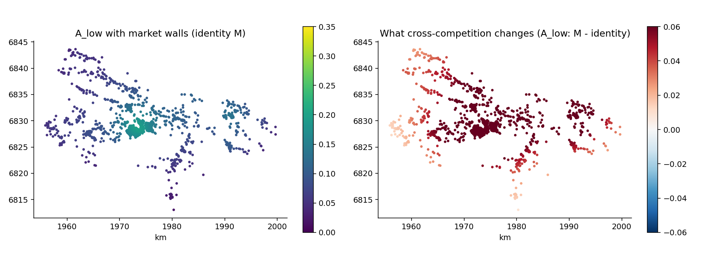

# 13. Competition: the FCA family and the propensity matrix

## The idea

Access potential (chapter 12) counts what you can reach. But jobs,
school places and GP appointments are **rival**: what I take, you
cannot. The floating-catchment family (FCA) prices that rivalry in
one pass — no iteration. The algorithm in plain words, exactly as a
researcher first sketched it on paper: (1) from each home, the
decayed sum of reachable jobs; (2) from each workplace, the decayed
search pressure aimed at it; (3) deflate each workplace's jobs by its
pressure — offer 5 jobs under pressure 10 and the *competed-for*
stock is 0.5; (4) re-sum from each home using competed-for stocks.
That is `method="2sfca"`, the default, and its two outputs carry the
whole story: **A**, the jobs-per-worker actually available to you,
and **J**, step (1)'s competition-blind potential — so **J/A is the
effective competitor mass you face per visible job**.

Different people compete in different markets. The binary version is
the *match table* (`fca_segments`): low-educated workers versus
low-education jobs, everyone versus everything. But real search is
not binary — and this is where the **propensity matrix M** enters:
M[g][c] is the share of group g's search aimed at job category c.
Identity M reproduces the binary walls exactly (regression-tested to
1e-12); anything else lets markets leak into each other.



On the anonymised municipality (real register structure), the walls
scenario gives low-educated workers A = 0.154 jobs per worker. Let
merely 15 % of their search cross into the other market — while 25 %
of educated search invades theirs — and A_low almost **doubles** to
0.301: reaching a richer adjacent market outweighs the invasion of
one's own poor one. The map on the right shows *where* that gain
lands. The scenario's M is illustrative, and that is the refrain of
this chapter: **the matrix is the model** — estimate it, don't
assume it.

## Cook it

```python
from equipop.datasets import load
from equipop.decay import Decay
from equipop.fca import fca_segments, fca_propensity
import pandas as pd

p, j = load("municipality")
dec = Decay(model="negexp", half_life_m=3000)

M = pd.DataFrame([[0.85, 0.15], [0.25, 0.75]],
                 index=["low", "oth"], columns=["lowjob", "othjob"])
d, s = fca_propensity(p, j, M,
        {"low": "LowEdu_sum", "oth": "Other_sum"},
        {"lowjob": "LowEdu_jobs", "othjob": "Other_jobs"}, decay=dec)
# d: A_low, A_oth, J_low, J_oth   s: R_lowjob, R_othjob
```

## The dials

`reach` from the neighbourhood menu (decay / r / kFCA / effort with a
DEM and round trips); `method="3sfca"` for demand-splitting;
`balance=` for the doubly-constrained market-clearing variant;
`cell_propensity=True` for spatially varying propensities (below).

## Under the hood

**Estimating M.** Two recommended estimators. *(c)* Your existing
per-category regressions (OLS/logit, multilevel): predict each
person's probability of holding each category, **strip the area
effects from the prediction** — geography belongs to the FCA, not to
M, and keeping both double-counts space — then row-normalize: each
row is a search allocation summing to 1 (the convention that keeps A
in jobs-per-worker and groups comparable). *(f)* The **propensity
field**: don't average predictions into one matrix per group at all —
average them per *cell*, and pass the per-cell probability columns
with `cell_propensity=True`. In a segregated town, where you live
predicts what you search for; the field lets M vary over the map at
zero extra engine cost. A cross-tab of observed job-holding is the
assumption-free baseline — but it measures *realized allocation
under the current matching regime*, not search intent; name which
one your question needs.

Mechanics worth knowing: rows of M are loudly normalized if they
don't sum to 1; structural zeros (ineligibility) are respected;
demand cells reaching no supply get A = 0 with a count, never a
silent NaN; and the doubly-constrained mode documents two textbook
omissions — supply-margin scaling for imbalanced markets, and the
gauge freedom of the balancing factors.

## Pitfalls

The +95 % above is a *scenario*, not a finding — its M was chosen for
the figure. With an estimated M the number is research; without one
it is sensitivity analysis. Both are legitimate, and confusing them
is not. And remember J: reporting A without J hides how much of the
change is competition rather than reach.
