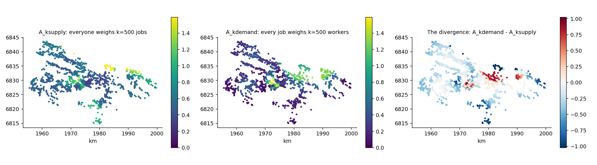

# 13. Competition: the FCA family and the propensity matrix

## The idea

The access measures of chapter 12 count what you can reach. But many
of the things worth reaching — jobs, school places, appointments at
a clinic — are **rival**: what I take, you cannot have. A town where
everyone can *reach* five hundred jobs but ten thousand people are
reaching for them is not a town of good access. The floating-
catchment family of methods (FCA, for *Floating Catchment Area*)
prices that rivalry, and it does so in one straightforward pass, no
iteration, no equilibrium-solving.

The algorithm is best understood exactly as a researcher first
sketched it on paper, in four steps. **Step one:** from each home,
sum up the reachable jobs, letting distant ones count less (the
distance-decay idea of chapter 7). **Step two:** turn the telescope
around — from each *workplace*, sum up the search pressure aimed at
it: how many decay-weighted job-seekers can reach this place?
**Step three:** deflate. A workplace offering 5 jobs under a
pressure of 10 seekers has, per seeker, only 5 ÷ 10 = 0.5
*competed-for* jobs to give. **Step four:** return to the homes and
re-do step one, but summing the competed-for stocks instead of the
raw ones. The result, called **A**, is each home's jobs-per-worker
*actually available once everyone else is also reaching*. Step
one's raw sum is kept too, under the name **J** — and comparing
them is illuminating: J is what you can see, A is what you can get,
and J divided by A tells you how many effective competitors stand
between you and each visible job.

So far, one big market. But real people compete in *segments*: a
job requiring a medical degree is not part of everyone's market.
The simple version handles this with a **match table** — run the
analysis once for low-educated workers against low-education jobs,
once for everyone else against the rest, walls between the markets.
The refined version, and the subject of this chapter's second half,
replaces the walls with a **propensity matrix**, written M. Each
row of M belongs to a group of workers; each column to a category
of jobs; and each entry is the share of that group's job search
aimed at that category. A row like (0.85, 0.15) says: this group
directs 85 % of its search at the first category and 15 % at the
second. One special case is worth pausing on. Suppose the matrix
says every group searches only within "its own" category — a 1 in
each row's own column, 0 everywhere else (mathematicians call this
shape an *identity matrix*). With that table, the propensity method
gives exactly the same numbers as the walls version — not roughly
the same, but the same to more decimal places than the computer can
meaningfully print, and an automatic test re-checks this agreement
every time the software changes, so the two can never quietly drift
apart. The moment any entry departs from 0 or 1, the walls become
porous, and the markets begin to influence each other's competition.


The figure runs on the anonymised municipality data — a real Swedish
register whose coordinates were rigidly moved to protect privacy
while keeping every distance intact. Under the walls scenario,
low-educated workers face a stark market: A = 0.154, roughly one
available job for every six and a half seekers. The right panel
shows what happens under an *illustrative* propensity matrix in
which 15 % of low-educated search crosses into the other market
while 25 % of educated search invades theirs: low-educated access
nearly **doubles**, to 0.301. Reaching even a modest slice of the
richer adjacent market outweighs the extra invasion of one's own
poorer one — the walls themselves were a large part of the penalty.
The map shows *where* the gain lands. And here the chapter's
refrain must be said plainly: that matrix was **chosen for the
figure**, not estimated from behaviour. The matrix *is* the model.

## Cook it

```python
from equipop.datasets import load
from equipop.decay import Decay
from equipop.fca import fca_segments, fca_propensity
import pandas as pd

p, j = load("municipality")
dec = Decay(model="negexp", half_life_m=3000)

M = pd.DataFrame([[0.85, 0.15], [0.25, 0.75]],
                 index=["low", "oth"], columns=["lowjob", "othjob"])
d, s = fca_propensity(p, j, M,
        {"low": "LowEdu_sum", "oth": "Other_sum"},
        {"lowjob": "LowEdu_jobs", "othjob": "Other_jobs"}, decay=dec)
# d gains A_low, A_oth, J_low, J_oth ;  s gains R_lowjob, R_othjob
```

Reading the call: the two dictionaries name which column holds each
group's workers and each category's jobs; `M` is the search table;
and the decay object sets how fast distance fades relevance (here,
a job 3 kilometres away counts half). The outputs follow the story
above — one A and one J per group of workers, one competed-for
ratio R per category of jobs.

## The dials

`reach` picks the neighbourhood definition from chapter 4's menu
(decay, radius, the fixed-mass kFCA catchments, or travel effort
over a terrain model with the round trip home included);
`method="3sfca"` adds a further refinement in which demand first
splits itself across reachable options; `balance=` switches to a
market-clearing variant for readers with an economics background;
and `cell_propensity=True` unlocks the spatially varying version of
M described next.

## Under the hood

**Where should M come from?** Two estimators are recommended, and
one honest baseline. The baseline is the observed cross-table: among
employed members of each group, the shares actually holding each
job category. It requires no model at all — but be clear about what
it measures: the *outcome* of past matching, complete with any
exclusion built into it, not what people would search for in an
open market. The first recommended estimator, (c), reuses
regressions you may already have: predict each person's probability
of holding each category, then divide each group's vector by its
sum so it adds to one. One warning matters here: if your regression
included area effects (as multilevel models do), **strip them from
the prediction** — geography is the FCA's job, and keeping it in M
as well would count the same space twice. The second estimator,
(f), is the ambitious one: do not average the predictions into one
matrix per group at all. Average them per *map square* instead, and
pass the per-square probability columns with `cell_propensity=True`.
In a segregated town, where you live predicts what you search for;
this "propensity field" lets the matrix vary across the map, and
the engine carries it at no extra cost. Housekeeping is loud as
always: rows that do not sum to one are normalized with a printed
notice; a genuinely impossible match (an entry of exactly zero)
stays impossible; and a home that can reach no supply at all
receives A = 0 with a printed count, never a silently missing
value.

**Both sides of k.** One dial deserves its own passage, because it
turns out to hide a research question. Chapter 4's fixed-mass
neighbourhoods appear here as the kFCA reach: catchments that grow
until they contain k units of mass. The quiet question is: k units
of *whose* mass? Setting `k_side="supply"` means every worker
weighs their nearest 500 *jobs*, wherever those are — everyone
faces the same menu of options, and the ground it covers floats.
Setting `k_side="demand"` reverses the telescope: every *workplace*
weighs its nearest 500 workers — each employer has a recruitment
pool of fixed size, and access at a home reflects how many such
pools it belongs to. Both are reasonable stories about how labour
markets work; they simply are not the same story. Setting
`k_side="both"` computes the pair in one call, returning
`A_ksupply` and `A_kdemand` side by side (the names carry the
anchored mass, so they read correctly whether the "supply" is
jobs, clinics or school places).



How different can two reasonable conventions be? On the anonymised
municipality, very: the two access maps correlate at only 0.33,
and for a typical home the two numbers differ by about 0.29 — on
an access level averaging 0.63, which is to say the convention
choice moves the answer by roughly half its size, even though both
versions conserve the same municipal total. The divergence map on
the right shows the disagreement's geography: red where fixed
recruitment pools flatter a home, blue where a fixed job menu
does. The lesson is the propensity lesson in different clothing:
what looks like a technical setting is a model of behaviour, and
when two defensible models disagree this much, the disagreement
itself belongs in the paper.

## Pitfalls

The +95 % in the figure is a *scenario*, not a finding: its matrix
was invented to make the mechanism visible. With a matrix estimated
from your own data, the same computation becomes research; without
one, it is sensitivity analysis. Both are legitimate — confusing
them is not, and every caption should say which one it is. A second
habit worth forming: never report A without J beside it. A alone
cannot tell the reader whether a change came from geography (more
jobs within reach) or from competition (the same jobs, fewer rivals)
— the pair can.
